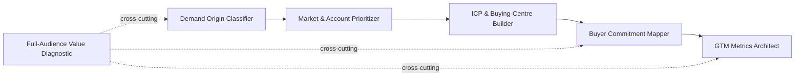

# GTM Skills

Six Claude Skills for diagnosing the most common breakpoints in a B2B go-to-market engine — demand classification, account targeting, buyer-journey content mapping, ICP sizing, metrics design, and marketing value framing.

These are the operating patterns I use in practice, written up so a Claude-equipped RevOps, marketing, or sales team can apply them directly.

## How the six fit together

Classify demand first — it determines who you're targeting and how. Prioritize the market and accounts. Define the ICP at the right altitude. Map content to where the buyer actually is. Measure what you built against real decisions. The value diagnostic runs alongside all of it — a reminder that GTM output serves more than one audience.

## What each one fixes

| Skill | Fixes |
|---|---|
| [`demand-origin-classifier`](skills/demand-origin-classifier/SKILL.md) | Messaging and lead-qual bars set without knowing whether demand is dormant, substitution, or active-category |
| [`market-account-prioritizer`](skills/market-account-prioritizer/SKILL.md) | Target lists built on "who *could* buy" instead of "who *will* buy" |
| [`buyer-commitment-mapper`](skills/buyer-commitment-mapper/SKILL.md) | Content and CTAs with no assigned buying stage — decorative, not converting |
| [`icp-buying-center-builder`](skills/icp-buying-center-builder/SKILL.md) | ICP defined at account/segment level instead of the buying centre that actually owns the decision |
| [`gtm-metrics-architect`](skills/gtm-metrics-architect/SKILL.md) | Dashboards reporting activity as if it were business impact |
| [`full-audience-value-diagnostic`](skills/full-audience-value-diagnostic/SKILL.md) | Marketing reduced to "lead factory" — value to every other audience invisible |

Each is a standalone `SKILL.md` — Claude reads the trigger conditions and applies the method automatically when the situation matches.

## Install

**Claude.ai / Claude Projects:** copy any `skills/<name>/SKILL.md` file into your project's skills.
**Claude Code:** drop a skill folder into your skills directory, or point Claude at this repo directly.

Use one or all six — they're independent, but designed to hand off to each other in the sequence above.

## Background

I've spent 15+ years running RevOps/GTM inside Finastra, Equinix, Nutanix, Pleo, Contentsquare, and DevRev — see the [main profile](../README.md) for the detail. These skills are that experience turned into something reusable rather than something I re-explain from scratch on every engagement.

## License

MIT, scoped to this folder — see [LICENSE](LICENSE). Use freely; attribution appreciated.
