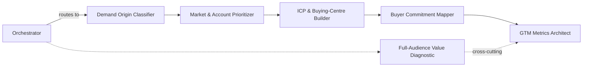

# GTM Skills

Seven Claude Skills for diagnosing the most common breakpoints in a B2B go-to-market engine — six focused diagnostics plus a coordinator that routes messy, real-world problems through the right ones automatically.

These are the operating patterns I use in practice, written up so a Claude-equipped RevOps, marketing, or sales team can apply them directly.

## The seven

| Skill | Fixes |
|---|---|
| [`gtm-diagnostic-orchestrator`](skills/gtm-diagnostic-orchestrator/SKILL.md) | Ambiguous problems that don't map to one skill — routes and sequences the other six |
| [`demand-origin-classifier`](skills/demand-origin-classifier/SKILL.md) | Messaging and lead-qual bars set without knowing whether demand is dormant, substitution, or active-category |
| [`market-account-prioritizer`](skills/market-account-prioritizer/SKILL.md) | Target lists built on "who *could* buy" instead of "who *will* buy" |
| [`icp-buying-center-builder`](skills/icp-buying-center-builder/SKILL.md) | ICP defined at account/segment level instead of the buying centre that actually owns the decision |
| [`buyer-commitment-mapper`](skills/buyer-commitment-mapper/SKILL.md) | Content and CTAs with no assigned buying stage — decorative, not converting |
| [`gtm-metrics-architect`](skills/gtm-metrics-architect/SKILL.md) | Dashboards reporting activity as if it were business impact |
| [`full-audience-value-diagnostic`](skills/full-audience-value-diagnostic/SKILL.md) | Marketing reduced to "lead factory" — value to every other audience invisible |

## How they work together



Each skill works standalone — Claude reads its trigger conditions and applies it when a situation matches, no manual invocation needed. The **orchestrator** is what turns them into a coordinated system: describe a real, messy problem and it decides which sub-skills apply, runs them in sequence, checkpoints findings with you between stages, and returns one combined diagnostic instead of six disconnected ones. See the orchestrator's own file for the full routing table.

## Setup

**Claude.ai / Claude Projects**
1. Open your Project → **Settings** → **Skills** (or **Project knowledge**, depending on your plan).
2. Add each `SKILL.md` file individually, or add the whole `gtmskills/skills/` folder if your setup supports folder upload.
3. Skills activate automatically in that project's conversations — no slash command needed.

**Claude Code**
```bash
git clone https://github.com/christopherswarup/portfolio.git
cp -r portfolio/gtmskills/skills/* ~/.claude/skills/
```
Each skill lands in its own subdirectory under `~/.claude/skills/`. Claude Code picks them up on the next session.

**Claude Desktop / Cowork**
Same copy step as Claude Code — both read from the same skills directory.

## How to use — example prompts

You don't invoke these by name. Just describe the situation; the trigger conditions in each `SKILL.md` do the matching.

| If you say something like... | This fires |
|---|---|
| "We're launching in the mid-market segment — how should we message this?" | `demand-origin-classifier` |
| "Build me a target account list for enterprise fintech" | `market-account-prioritizer` |
| "Our ICP is 'companies with 500+ employees' — is that specific enough?" | `icp-buying-center-builder` |
| "Here's our content calendar — why isn't it converting?" | `buyer-commitment-mapper` |
| "Review this dashboard before it goes to the board" | `gtm-metrics-architect` |
| "Finance thinks marketing is just a cost center" | `full-audience-value-diagnostic` |
| "Pipeline is down and nobody agrees on why" | `gtm-diagnostic-orchestrator` (ambiguous → runs the full sequence) |

## Example scenarios

**Launching in a new segment.**
*"We're moving into mid-market — where do we even start?"* → Orchestrator routes through `demand-origin-classifier` (is this segment Dormant, Substitution, or Active-Category demand?) → `market-account-prioritizer` (screen the segment before naming accounts) → `icp-buying-center-builder` (define the ICP at buying-centre level, not just "mid-market"). Each step's finding changes the next — a Dormant classification, for example, shifts the account screen toward "who can sponsor change" rather than standard fit criteria.

**A dashboard headed for the board.**
*"Can you check this before Thursday's board meeting?"* → `gtm-metrics-architect` classifies every metric on the deck (Activity/Output/Outcome/Impact), flags any Activity number being presented as if it proved Impact, and checks each metric names an actual decision. Runs alongside `full-audience-value-diagnostic` if the deck is also being used to defend marketing's budget.

**Content that isn't landing.**
*"We've published a ton of content but conversion hasn't moved."* → `buyer-commitment-mapper` inventories existing content against the six buying stages, flags anything with no assignable stage as decorative, and identifies which stage has the biggest content gap — usually an early-stage gap, which no amount of later-stage content can fix.

**"Pipeline is down" with no clear cause.**
The ambiguous case → `gtm-diagnostic-orchestrator` takes over, runs the relevant sub-skills in sequence with checkpoints between each, and returns one integrated diagnosis with the 2-3 highest-leverage fixes rather than a symptom-by-symptom list.

## Background

I've spent 15+ years running RevOps/GTM inside Finastra, Equinix, Nutanix, Pleo, Contentsquare, and DevRev — see the [main profile](../README.md) for the detail. These skills are that experience turned into something reusable rather than something I re-explain from scratch on every engagement.

## License

MIT, scoped to this folder — see [LICENSE](LICENSE). Use freely; attribution appreciated.
