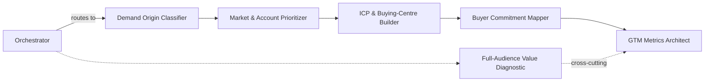

# GTM Skills

Seven Claude Skills for diagnosing the most common breakpoints in a B2B go-to-market engine — six focused diagnostics plus a coordinator that routes messy, real-world problems through the right ones automatically.

These are the operating patterns I use in practice, written up so a Claude-equipped RevOps, marketing, or sales team can apply them directly.

⭐ If this catches something in your GTM diagnosis, a star helps other RevOps/GTM people find it.

## The seven

| Skill | Fixes |
|---|---|
| [`gtm-diagnostic-orchestrator`](skills/gtm-diagnostic-orchestrator/SKILL.md) | Ambiguous problems that don't map to one skill — routes and sequences the other six |
| [`demand-origin-classifier`](skills/demand-origin-classifier/SKILL.md) | Messaging and lead-qual bars set without knowing whether demand is dormant, substitution, or active-category |
| [`market-account-prioritizer`](skills/market-account-prioritizer/SKILL.md) | Target lists built on "who *could* buy" instead of "who *will* buy" |
| [`icp-buying-center-builder`](skills/icp-buying-center-builder/SKILL.md) | ICP defined at account/segment level instead of the buying centre that actually owns the decision |
| [`buyer-commitment-mapper`](skills/buyer-commitment-mapper/SKILL.md) | Content and CTAs with no assigned buying stage — decorative, not converting |
| [`gtm-metrics-architect`](skills/gtm-metrics-architect/SKILL.md) | Dashboards reporting activity as if it were business impact |
| [`full-audience-value-diagnostic`](skills/full-audience-value-diagnostic/SKILL.md) | Marketing reduced to "lead factory" — value to every other audience invisible |

## How they work together



Each skill works standalone — Claude reads its trigger conditions and applies it when a situation matches, no manual invocation needed. The **orchestrator** is what turns them into a coordinated system: describe a real, messy problem and it decides which sub-skills apply, runs them in sequence, checkpoints findings with you between stages, and returns one combined diagnostic instead of six disconnected ones. See the orchestrator's own file for the full routing table.

## Setup

**Claude Code — one-command install (recommended)**
```bash
/plugin marketplace add christopherswarup/portfolio
/plugin install gtm-skills@christopherswarup-gtm-skills
```
This registers the marketplace defined at the repo root and installs all seven skills as a single plugin. Update later with `/plugin update gtm-skills@christopherswarup-gtm-skills`.

**Claude.ai / Claude Projects**
1. Open your Project → **Settings** → **Skills** (or **Project knowledge**, depending on your plan).
2. Add each `SKILL.md` file individually, or add the whole `gtmskills/skills/` folder if your setup supports folder upload.
3. Skills activate automatically in that project's conversations — no slash command needed.

**Manual copy (Claude Code, Desktop, or Cowork, without the plugin marketplace)**
```bash
git clone https://github.com/christopherswarup/portfolio.git
cp -r portfolio/gtmskills/skills/* ~/.claude/skills/
```
Each skill lands in its own subdirectory under `~/.claude/skills/`. Picked up on the next session.

## How to use

You don't invoke these by name. Just describe the situation; the trigger conditions in each `SKILL.md` do the matching.

### Quick reference

| If you say something like... | This fires |
|---|---|
| "We're launching in the mid-market segment — how should we message this?" | `demand-origin-classifier` |
| "Build me a target account list for enterprise fintech" | `market-account-prioritizer` |
| "Our ICP is 'companies with 500+ employees' — is that specific enough?" | `icp-buying-center-builder` |
| "Here's our content calendar — why isn't it converting?" | `buyer-commitment-mapper` |
| "Review this dashboard before it goes to the board" | `gtm-metrics-architect` |
| "Finance thinks marketing is just a cost center" | `full-audience-value-diagnostic` |
| "Pipeline is down and nobody agrees on why" | `gtm-diagnostic-orchestrator` (ambiguous → runs the full sequence) |

### Prompt examples and what to bring

Each skill works with whatever you have — none of this is a hard blocker, but the more of the "bring" list you paste in upfront, the less back-and-forth it takes to get a real answer instead of a generic one.

**`demand-origin-classifier`**
- *"We're launching in mid-market — is that Dormant or Active-Category demand for us?"*
- *"Prospects keep saying 'we've never really thought about this' — what does that tell us?"*
- *"Compare the demand type for our core product vs. our new AI add-on."*
- **Bring:** what the product solves and for whom · *(helpful)* real prospect language, what they use today instead, evidence of existing category budget

**`market-account-prioritizer`**
- *"Here's our list of 40 target accounts in fintech — score and prioritize them."*
- *"We're deciding between healthcare and manufacturing as our next vertical — screen both."*
- *"Score these 15 named accounts on winnability" (paste a list or CSV)*
- **Bring:** a candidate segment or account list · *(helpful)* market/growth data, account firmographics, sales capacity/coverage per account

**`icp-buying-center-builder`**
- *"Our ICP is '500+ employee SaaS companies' — that's too broad, tighten it."*
- *"Here's a list of our last 20 closed-won deals — what buying-centre pattern do you see?"*
- *"We're about to buy an intent-data tool — help us separate fit signals from intent signals first."*
- **Bring:** your current ICP definition, even informal · *(helpful)* a short best-fit customer list, CRM win/loss data

**`buyer-commitment-mapper`**
- *"Here's our Q1 content calendar — map it to buying stages."*
- *"Audit our website CTAs — which buying stage does each one actually serve?"*
- *"Sales says leads aren't ready to buy — check our top-of-funnel content for gaps."*
- **Bring:** an inventory of existing content/assets (titles + one-liners are enough) · *(helpful)* funnel/conversion data by stage, persona definitions

**`gtm-metrics-architect`**
- *"Here's our KPI dashboard — classify every metric by class and level."*
- *"Our exec dashboard has 40 metrics on it — which ones actually matter?"*
- *"Review this report before it goes to the board on Thursday."*
- **Bring:** the actual dashboard, report, or metric list in question · *(helpful)* who the audience is and what decision the report is meant to drive

**`full-audience-value-diagnostic`**
- *"Finance wants to cut our content team — help us build the case for keeping it."*
- *"List everything marketing did last quarter and show the value spread across audiences."*
- *"The board asked 'what does marketing actually do' — help me answer that."*
- **Bring:** a rough list of marketing's recent activity/programs · *(helpful)* the specific challenge being raised and who's raising it, any pipeline metrics already being cited against you

**`gtm-diagnostic-orchestrator`**
- *"Pipeline is down 20% quarter over quarter and marketing and sales are blaming each other."*
- *"Give me a full GTM health check before our planning offsite."*
- *"We're not sure if this is a demand problem or an execution problem — help us find out."*
- **Bring:** whatever's known about the symptom, however partial · *(helpful)* any hypothesis stakeholders have already proposed, whether it's a new-motion or existing-motion problem

## Example scenarios

**Launching in a new segment.**
*"We're moving into mid-market — where do we even start?"* → Orchestrator routes through `demand-origin-classifier` (is this segment Dormant, Substitution, or Active-Category demand?) → `market-account-prioritizer` (screen the segment before naming accounts) → `icp-buying-center-builder` (define the ICP at buying-centre level, not just "mid-market"). Each step's finding changes the next — a Dormant classification, for example, shifts the account screen toward "who can sponsor change" rather than standard fit criteria.

**A dashboard headed for the board.**
*"Can you check this before Thursday's board meeting?"* → `gtm-metrics-architect` classifies every metric on the deck (Activity/Output/Outcome/Impact), flags any Activity number being presented as if it proved Impact, and checks each metric names an actual decision. Runs alongside `full-audience-value-diagnostic` if the deck is also being used to defend marketing's budget.

**Content that isn't landing.**
*"We've published a ton of content but conversion hasn't moved."* → `buyer-commitment-mapper` inventories existing content against the six buying stages, flags anything with no assignable stage as decorative, and identifies which stage has the biggest content gap — usually an early-stage gap, which no amount of later-stage content can fix.

**"Pipeline is down" with no clear cause.**
The ambiguous case → `gtm-diagnostic-orchestrator` takes over, runs the relevant sub-skills in sequence with checkpoints between each, and returns one integrated diagnosis with the 2-3 highest-leverage fixes rather than a symptom-by-symptom list.

**Tightening a vague ICP.**
*"Our ICP is 'mid-market SaaS companies' and it's not actually helping anyone qualify leads."* → `icp-buying-center-builder` checks whether the target is sized against TAM (too broad) or SOM (correct), then pushes the definition down to buying-centre level — asking which specific department owns the budget and the pain, not just what kind of company fits.

**Defending marketing's budget.**
*"Finance wants to cut headcount on the content team — they only see it as a cost."* → `full-audience-value-diagnostic` maps what that team actually delivers across all seven audiences, not just pipeline. Pairs with `gtm-metrics-architect` if finance's case cites specific numbers that need auditing first.

## Background

I've spent 15+ years running RevOps/GTM inside Finastra, Equinix, Nutanix, Pleo, Contentsquare, and DevRev — see the [main profile](../README.md) for the detail. These skills are that experience turned into something reusable rather than something I re-explain from scratch on every engagement.

## Contributing

Found a gap, or a real-world case that sharpens one of these? Open an issue or a PR — field-tested corrections are the only kind these are built to take. This isn't a theoretical framework; if something doesn't hold up against a real GTM problem, I want to know.

## License

MIT, scoped to this folder — see [LICENSE](LICENSE). Use freely; attribution appreciated.
