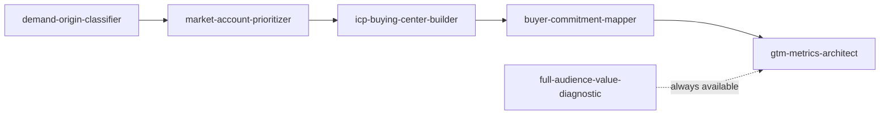

# GTM Diagnostic Orchestrator

Real GTM problems rarely arrive pre-sorted into one clean category. "Pipeline is down" could be a demand-classification problem, a targeting problem, a content-stage problem, a measurement problem, or two of those at once. This skill's job is to figure out which sub-skills apply, in what order, and to run them as one coordinated pass instead of leaving that routing to guesswork.

## Step 1 — Intake

Ask (or infer from what's already been said):
1. What's the actual symptom? (declining pipeline, poor conversion, content not landing, budget under attack, unclear targeting)
2. What's known already vs. assumed? Don't accept a stakeholder's proposed diagnosis at face value — that's a routing input, not a conclusion.
3. Is this a new-motion problem (launching somewhere new) or an existing-motion problem (something that used to work has degraded)?

## Step 2 — Route to the right sub-skills

| Symptom described | Sub-skill(s) to run | Why |
|---|---|---|
| "We're launching in a new segment/market" | `demand-origin-classifier` → `market-account-prioritizer` → `icp-buying-center-builder` | New motions need demand type and targeting settled before anything else |
| "Content/campaigns aren't converting" | `buyer-commitment-mapper` (check `demand-origin-classifier` if messaging tone is also in question) | Usually a stage-mismatch problem first |
| "Our metrics look fine but nothing's improving" or "the board doesn't trust the numbers" | `gtm-metrics-architect` | Class-inflation or wrong-altitude reporting is the default suspect |
| "Marketing's budget/headcount is being questioned" | `full-audience-value-diagnostic` (pair with `gtm-metrics-architect` if the challenge cites specific numbers) | Broadens the value case beyond pipeline alone |
| "Pipeline is down" (generic, cause unknown) | Run **all six** in the sequence below — this is the ambiguous case that needs the full pass | Could be any of the above; don't guess without evidence |

If the symptom doesn't clearly match a row, default to the full six-skill sequence rather than picking one arbitrarily.

## Step 3 — Sequence (when running more than one)

Run left to right. Each skill's output feeds context into the next — e.g., the demand origin classified in step one should inform how `buyer-commitment-mapper` reads stage-fit later on. `full-audience-value-diagnostic` isn't sequence-dependent; it can run whenever the value-framing question comes up, independent of where the rest of the sequence is.

## Step 4 — Checkpoint between stages

Don't run all six silently and dump a wall of output. After each sub-skill:
- State the finding in 1-2 lines.
- Ask whether it changes the plan before continuing (a Dormant demand-origin finding, for example, should visibly redirect what `market-account-prioritizer` even screens for).
- Only proceed to the next sub-skill once the prior finding is acknowledged or the user says to keep going.

This mirrors how a real diagnostic engagement runs — findings early in the sequence should actually change what gets investigated next, not just get appended to a report.

## Step 5 — Combined output

At the end of a multi-skill run, produce one integrated diagnostic, not six separate ones stapled together:

- **Root symptom** (as originally described)
- **What was actually found**, per sub-skill run, in sequence
- **How the findings connect** — did an earlier finding change the later analysis? Say so explicitly.
- **The 2-3 highest-leverage fixes**, not an exhaustive list from every skill
- **What's still unknown** and what evidence would resolve it

## When NOT to use this skill

If someone names a specific, narrow problem that maps cleanly to one sub-skill ("build me a target account list," "review this dashboard"), use that skill directly — don't route through the orchestrator for something that doesn't need coordination. This skill exists for the ambiguous, multi-causal cases where routing itself is part of the work.

---
*The coordinator for the [GTM Skills collection](../../README.md) by [Christopher Swarup](https://github.com/christopherswarup) — GTM Ops leader, 15+ years in RevOps/MOPS across Finastra, Equinix, Nutanix, Pleo, Contentsquare and DevRev.*
